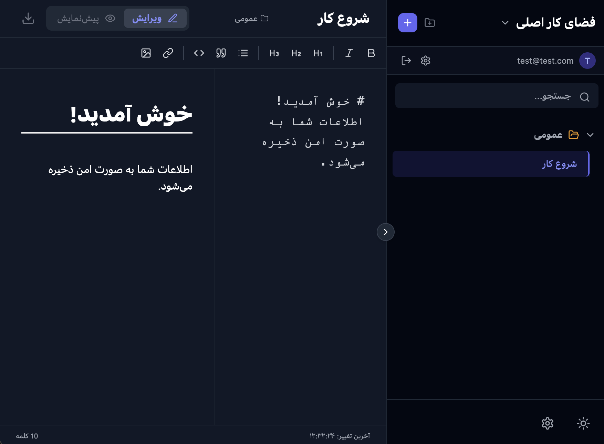

# ویرایشگر متن فارسی (مشابه اوبسیدین) 📝
**این ابزار برای استفاده شخصی و توسط هوش مصنوعی توسعه داده شده است.**

یک ابزار قدرتمند یادداشت‌برداری و مستندسازی تحت وب با پشتیبانی کامل از زبان فارسی (RTL)، که با الهام از نرم‌افزار محبوب Obsidian طراحی شده است. این پروژه با استفاده از React و Tailwind CSS ساخته شده و تمام داده‌ها را به صورت امن در حافظه مرورگر (Local Storage) ذخیره می‌کند.

## ✨ ویژگی‌های کلیدی

* **پشتیبانی کامل از زبان فارسی:** رابط کاربری راست‌چین (RTL) و فونت‌های استاندارد.
* **سیستم احراز هویت داخلی (Mock Auth):**
    * قابلیت ثبت‌نام و ورود کاربران.
    * شبیه‌سازی تایید ایمیل (Email Verification).
    * بازیابی و تغییر رمز عبور.
* **مدیریت پیشرفته فایل‌ها:**
    * **فضاهای کاری (Workspaces):** امکان ایجاد چندین فضای کاری مجزا برای پروژه‌های مختلف.
    * **پوشه‌بندی:** دسته‌بندی یادداشت‌ها در پوشه‌های دلخواه.
    * ساختار درختی و با قابلیت باز و بسته شدن.
* **ویرایشگر قدرتمند:**
    * پشتیبانی کامل از Markdown.
    * نوار ابزار (Toolbar) برای فرمت‌دهی سریع (بولد، ایتالیک، لیست، تصویر و...).
    * حالت پیش‌نمایش زنده (Live Preview).
* **ظاهر مدرن و واکنش‌گرا:**
    * حالت تیره و روشن (Dark/Light Mode).
    * طراحی مینیمال و زیبا با استفاده از آیکون‌های Lucide.
* **امنیت و پایداری:**
    * ذخیره‌سازی داده‌ها به تفکیک هر کاربر (Multi-user support simulation).

## 🛠 تکنولوژی‌های استفاده شده

* **React.js:** کتابخانه اصلی رابط کاربری.
* **Tailwind CSS:** فریم‌ورک استایل‌دهی.
* **Lucide React:** مجموعه آیکون‌های مدرن.
* **Firebase SDK:** (استفاده شده برای ساختاردهی، اما با سیستم Mock Auth جایگزین شده تا بدون نیاز به سرور کار کند).

## 🚀 نحوه اجرا

این پروژه به صورت یک فایل تک‌صفحه‌ای (Single File Component) طراحی شده است اما می‌توان آن را در یک پروژه استاندارد React اجرا کرد.

1.  یک پروژه جدید React بسازید:
    ```bash
    npx create-react-app persian-obsidian
    cd persian-obsidian
    ```

2.  وابستگی‌های لازم را نصب کنید:
    ```bash
    npm install lucide-react firebase
    ```
    *(نکته: برای استایل‌دهی باید Tailwind CSS را در پروژه خود کانفیگ کنید)*

3.  کدها را در فایل `src/App.js` کپی کنید و پروژه را اجرا کنید:
    ```bash
    npm start
    ```

## 📸 تصاویر




## 🤝 مشارکت

اگر ایده‌ای برای بهبود این پروژه دارید، خوشحال می‌شویم که مشارکت کنید. لطفاً ابتدا یک Issue باز کنید و سپس Pull Request ارسال نمایید.

## 📄 لایسنس

این پروژه تحت لایسنس MIT منتشر شده است.
